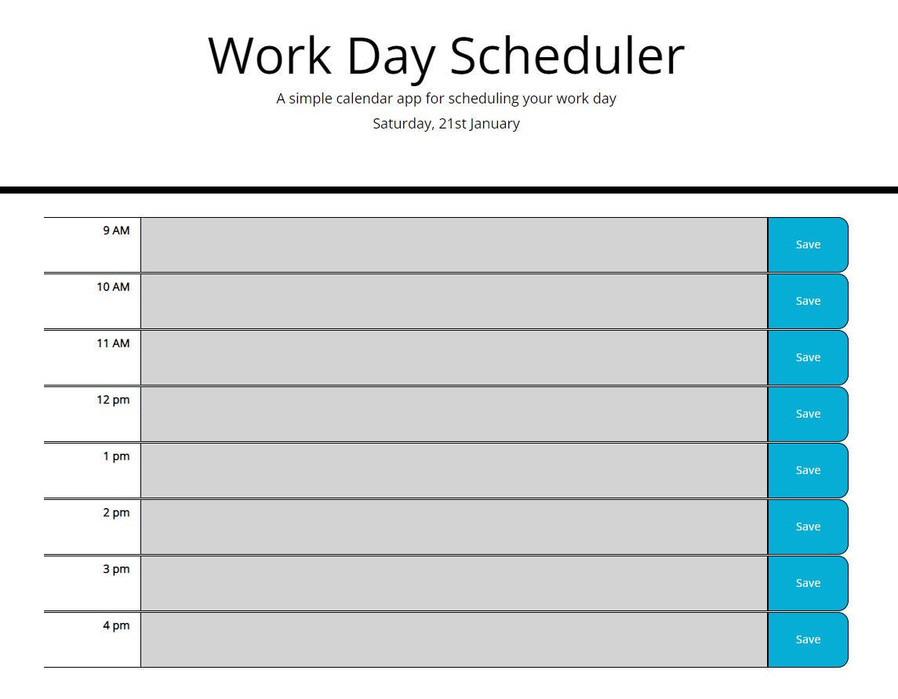

# Work-Day-Scheduler

## Description

Work day scheduler will allow the user to enter in events for each hour between 9-5. Upon hitting save the data entered will be saved to the user's local storage so the webpage can be closed and re-opened while retaining the events. 

## Installation

No installation necessary! However an internet browser is required and Google Chrome is reccomended. Link to website is: https://amarmalde.github.io/Work-Day-Scheduler/ and it should look similar to the below image.

